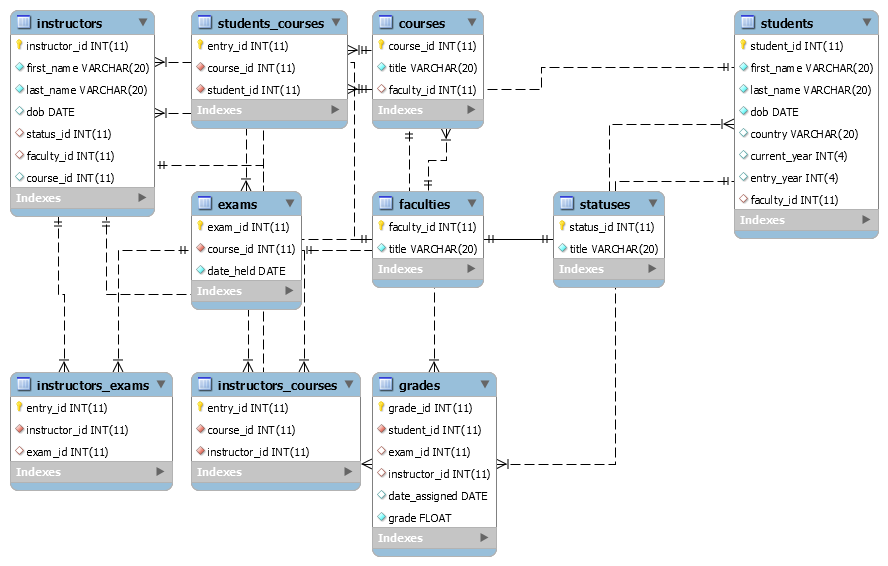
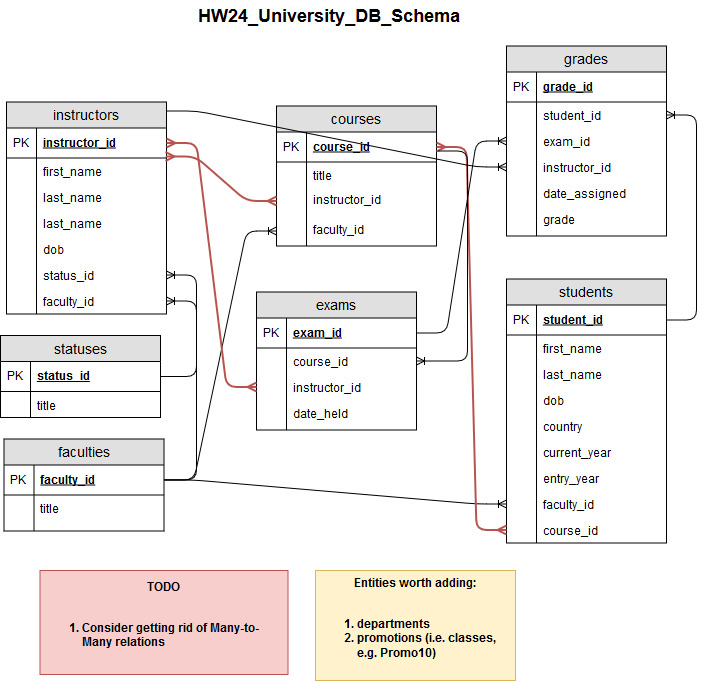

These MySQL queries allow for creating `university` database and tables with regard to [BackToSchool models](https://github.com/olenalo/HW/tree/4ce5c3d832983ce953535e563ecad768d4432af6/HW_19_IO/src/BackToSchool/models) (HW Nno.14,19). 

Also for reference: [Entry Exams System](https://github.com/olenalo/HW/tree/5ec5da5a859e4005b002a388d1a23b3d067d9cdd/HW_06_Entry%20Exams%2C%20Tower%20of%20Hanoi%2C%20Clocks/EntryExamsSystem/src/com/company) (HW No.06).

Auto-generated DB Schema:

DB Schema modelling: 

Editable version: [Draw.io schema](https://www.draw.io/#G1LahKoBsn8t3SkdzTJJRNGqKZmLlZ6oj-)
